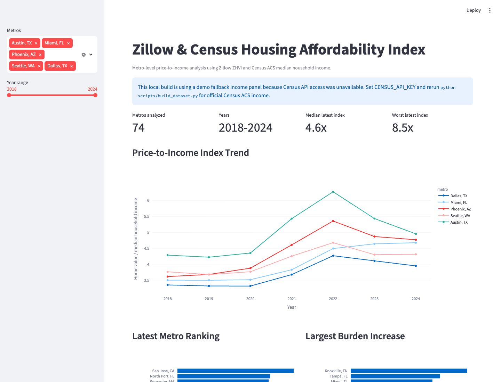

# Zillow & Census Housing Affordability Index

An end-to-end housing affordability analytics project using Zillow metro home values and Census ACS median household income. The project builds a metro-level price-to-income index for 2018-2024, estimates affordability trend slopes with Statsmodels, writes SQL-ready outputs, and presents the results in a Streamlit dashboard.

## Project At A Glance

| Area | Details |
|---|---|
| Domain | Real estate, public policy, economic analytics |
| Data Sources | Zillow ZHVI metro time series, Census ACS median household income |
| Time Period | 2018-2024 |
| Metric | `home value / median household income` |
| Dashboard | Streamlit |
| Analysis | Metro rankings, trend lines, affordability burden change, OLS slope estimates |

## Dashboard Preview



## Analysis Preview


## Business Question

Housing affordability worsens when home values rise faster than household income. This project answers:

- Which metros became the least affordable from 2018 to 2024?
- Where did price-to-income burdens rise fastest?
- How does Austin compare with other high-growth metros?
- Which metros show the steepest time-series trend in affordability pressure?

## Important Austin Framing

If Austin moves from `6.5x` to `11.0x` median income, the burden increased by about `69%`:

```text
(11.0 - 6.5) / 6.5 = 69.2%
```

That means affordability worsened. The project describes this as a price-to-income burden increase rather than a decline.

## Repository Structure

```text
zillow-census-housing-affordability/
├── app/
│   └── streamlit_app.py
├── data/
│   ├── README.md
│   └── processed/
├── docs/
│   └── METHODOLOGY.md
├── outputs/
│   ├── figures/
│   └── sql/
├── scripts/
│   ├── build_dataset.py
│   └── make_preview.py
├── src/
│   └── housing_affordability/
├── tests/
└── README.md
```

## Census API Key

The Census API may require a key depending on the environment and request volume. For official 50+ metro income coverage, set:

```bash
export CENSUS_API_KEY="your_key"
```

If the key is not available, the build script creates a clearly labeled demo fallback income panel so the Streamlit app can still be reviewed end to end.

## How To Run

```bash
python3 -m venv .venv
source .venv/bin/activate
pip install -r requirements.txt
python scripts/build_dataset.py
python scripts/make_preview.py
streamlit run app/streamlit_app.py
```

## Outputs

| Output | Purpose |
|---|---|
| `data/processed/metro_year_affordability.csv` | Metro-year affordability index table |
| `data/processed/metro_affordability_summary.csv` | 2018-2024 change summary and trend metrics |
| `data/processed/top_worsening_affordability.csv` | Top metros by affordability burden increase |
| `outputs/sql/housing_affordability.sqlite` | SQLite database for SQL review |
| `outputs/figures/housing_affordability_preview.png` | README/dashboard preview chart |
| `outputs/figures/streamlit_dashboard.png` | Streamlit dashboard screenshot |

## Local Validation

```bash
python -m unittest discover -s tests
```

The build script downloads Zillow data directly. It attempts Census ACS API ingestion first and uses a clearly labeled demo fallback income panel only when the API is unavailable in the local environment.

## Skills Demonstrated

- Public data ingestion from Zillow and Census
- Pandas time-series transformation
- SQL-ready analytics outputs with SQLite
- Statsmodels OLS trend estimation
- Streamlit dashboard development
- Real estate affordability and public-policy framing
